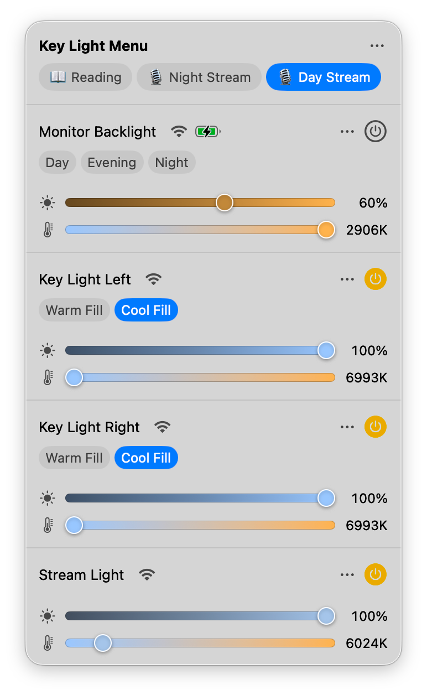
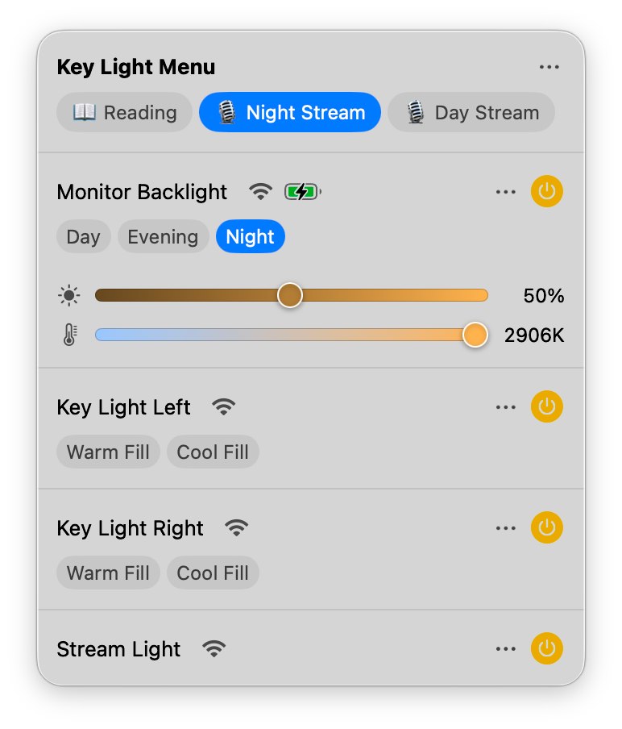
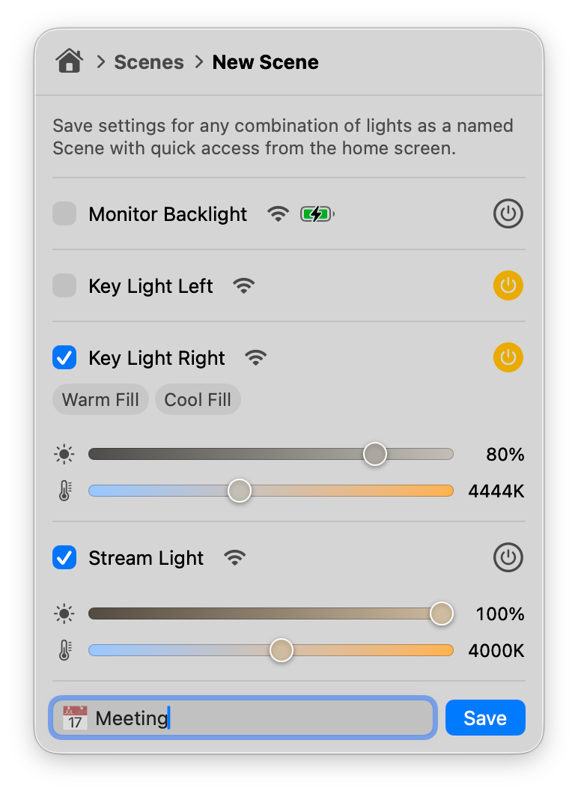
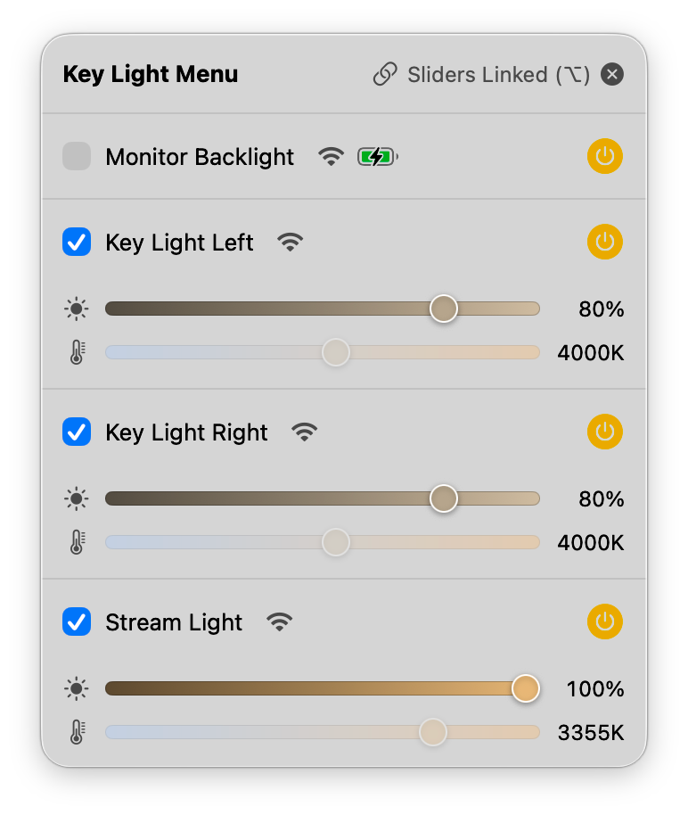
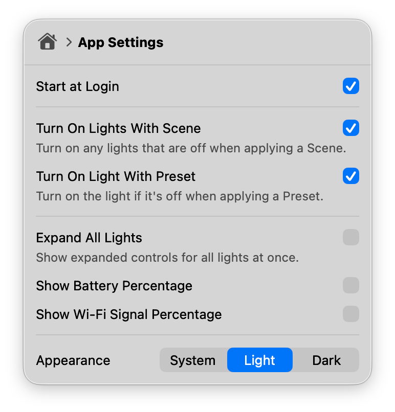
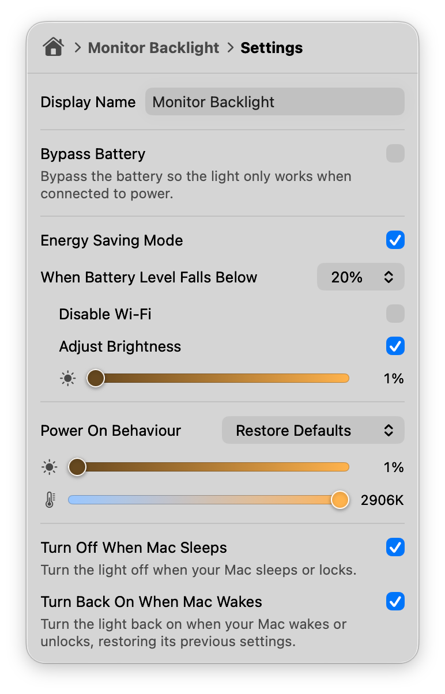

  
  <h1>Key Light Menu</h1>

A comprehensive macOS menu bar app for controlling Elgato Key Lights, featuring savable Presets, Scenes and other conveniences.

  
  

## Features

- **Presets** - Save brightness and colour temperature settings for a single light as a named Preset with a quick access button.
- **Scenes** - Save brightness and colour temperature settings for any combination of lights as a named Scene with a quick access button.
- **Selectable linked controls** - Link brightness and colour temperature sliders across any selection of lights and adjust them relative to eachother.
- **Turn lights off when Mac sleeps** - Choose lights to turn off when your Mac sleeps or locks.
- **Turn lights back on when Mac wakes** - Choose lights to turn back on when your Mac wakes or unlocks, restoring their previous settings.
- **Turn all lights off/on**
- **Compact or expanded view**
- **Light/dark mode**
- **Reorder lights**

## Compatibility

Key Light Menu should work with the following Elgato lights:

| Device | Supported |
|---|---|
| Elgato Key Light | ✓ |
| Elgato Key Light Air | ✓ |
| Elgato Key Light Mini | ✓ (tested) |
| Elgato Key Light Neo | ✓ |

## Download & Install

Download the [latest release](../../releases/latest).

When prompted, allow Key Light Menu permission to scan your local network so it can find and communicate with your Elgato Key Lights. It scans continuously for lights on your network and adds them automatically.

## Issues & Feedback

If you'd like to report an issue, request a feature or give feedback please [open a new issue](../../issues/new).

## Screenshots

  
  
  
  

## Disclaimer

Key Light Menu is an independent project and is not affiliated, associated, authorised, endorsed by, or in any way officially connected with Elgato or Corsair Gaming, Inc. All product and company names are trademarks™ or registered® trademarks of their respective holders. Use of them does not imply any affiliation with or endorsement by them.
